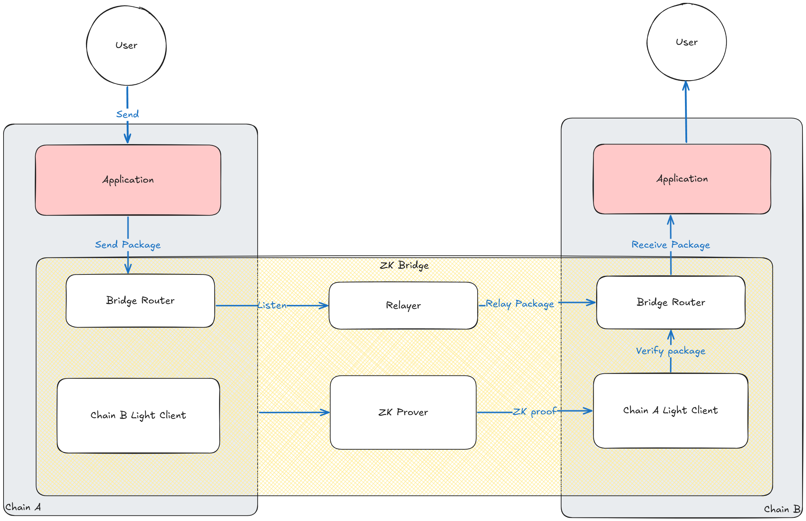

# ZK Bridge

A trust-minimized bridge between Cosmos and EVM chains powered by ZKP and IBC.
This project aims to provide a secure and efficient interoperability layer without relying on multisigs or centralized relayers, while still delivering high throughput and low cost.

## Overview 

### Features
- 🔗 IBC compatibilities: Fully integrates with Cosmos IBC standard for cross-chain messaging.
- ⚡ Fast proof generation: ZK proofs can be generated efficiently even on consumer-grade hardware.

### Structure
The repository is organized as follows:
- `contracts/`: Solidity smart contracts for EVM integration.
- `abi/`: ABI files and bytecode for contract interaction.
- `proto/`: Protocol buffer definitions for IBC messages.
- `test/`: Test suites for Solidity and integration tests.
- `scripts/`: Deployment and utility scripts.
- `docs/`: Documentation and assets.


- `contracts/`: Contains the Solidity contracts.
- `circuit/`: Gnark circuits and related files.
- `test/`: Contains the Solidity tests.
- `scripts/`: Contains Solidity scripts and tools.
- `abi/`: Contains the ABIs of the contracts needed for end-to-end tests.
- `e2e/`: Contains the end-to-end tests, powered by [interchaintest](https://github.com/strangelove-ventures/interchaintest).
- `operator/`: Go-based operator and relayer implementation.
- `programs/`: Contains the Rust programs for the project.
    - `relayer/`: Contains the relayer implementation.
    - `operator/`: Contains the fixture generator for the ZK light client.
    - `cw-ics08-wasm-eth/`: Contains the `CosmWasm` light client for Ethereum
- `packages/`: Contains the Rust packages for the project.
    - `go-abigen/`: Contains the abi generated go files for the Solidity contracts.


### Architecture
ZK Bridge consists of:
- **Light Clients**: Verifies state transitions on both Cosmos and EVM chains.
- **Bridge Router**: Implements IBC messaging and packet handling for cross-chain communication. IBC modules for Cosmos and Solidity contracts for EVM.
- **Relayer**: Facilitates message passing and proof submission between chains.
- **ZKP Prover**: Generates and verifies zero-knowledge proofs for trust-minimized validation.



## Build

### Prerequisites
- Go (for gnark ZKP circuits/operator/relayer)
- Rust & Cargo (for operators/relayer)
- Foundry (for Solidity development)
- Bun (for JS tooling)

### Build
Foundry typically uses git submodules to manage contract dependencies, but this repository uses Node.js packages (via Bun) because submodules don't scale. You can install the contracts dependencies by running the following command:

```sh
bun install
```

You also need to have the operator and relayer binaries installed on your machine to run some of the end-to-end tests. You can install them by running the following commands:

```sh
just install-operator
just install-relayer
```

To build the contracts and circuits:
```sh
# Compile Solidity contracts
cd contracts && ./compile.sh

# Build Go operator
cd operator && go build

# Build ZKP circuits
cd circuit && go build 
```

## Testing

### Solidity Tests
There are multiple unit tests for the solidity contracts located in the `test/` directory. The tests are written in Solidity using [foundry/forge](https://book.getfoundry.sh/forge/writing-tests).

To run all the tests, run the following command:

```sh
just test-foundry
```

The recipe also accepts a `testname` argument that will only run the test with the given name. For example:

```shell
just test-foundry testname-a
```

### End-to-End Tests
There are several end-to-end tests in the `e2e/interchaintestv8` directory. These tests are written in Go and use the [`interchaintest`](https://github.com/strangelove-ventures/interchaintest) library. 
It spins up a local Ethereum and a Tendermint network and runs the tests found in [`e2e/interchaintestv8/ibc_eureka_test.go`](e2e/interchaintestv8/ibc_eureka_test.go).

## License

This project is licensed under the MIT License. See `LICENSE.md` for details.

## Acknowledgements

- Cosmos IBC community
- Ethereum ecosystem contributors
- ZKP research and tooling projects


